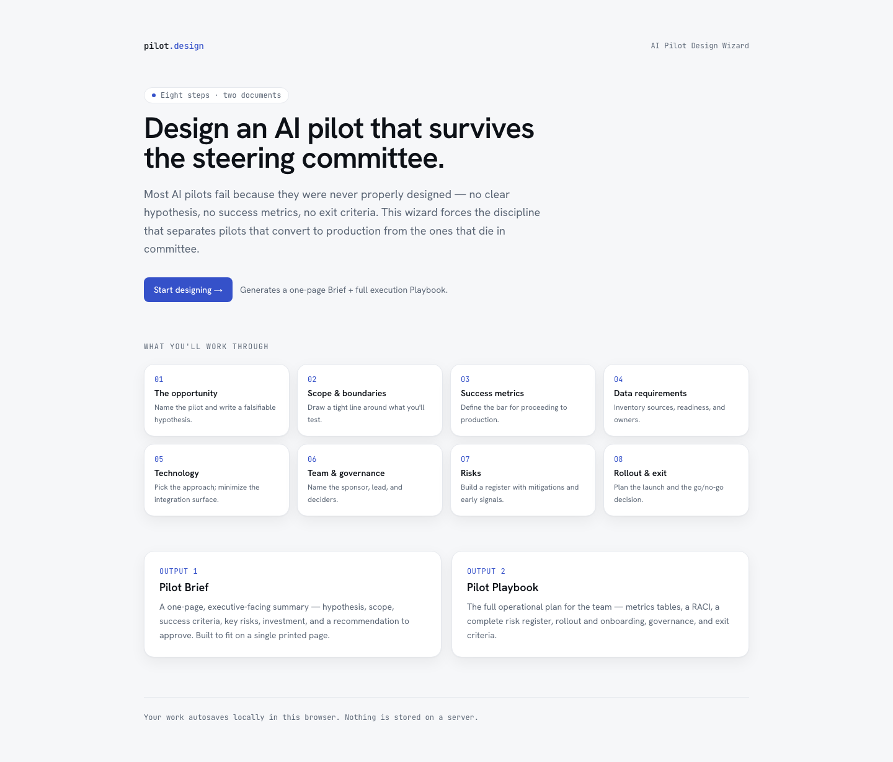
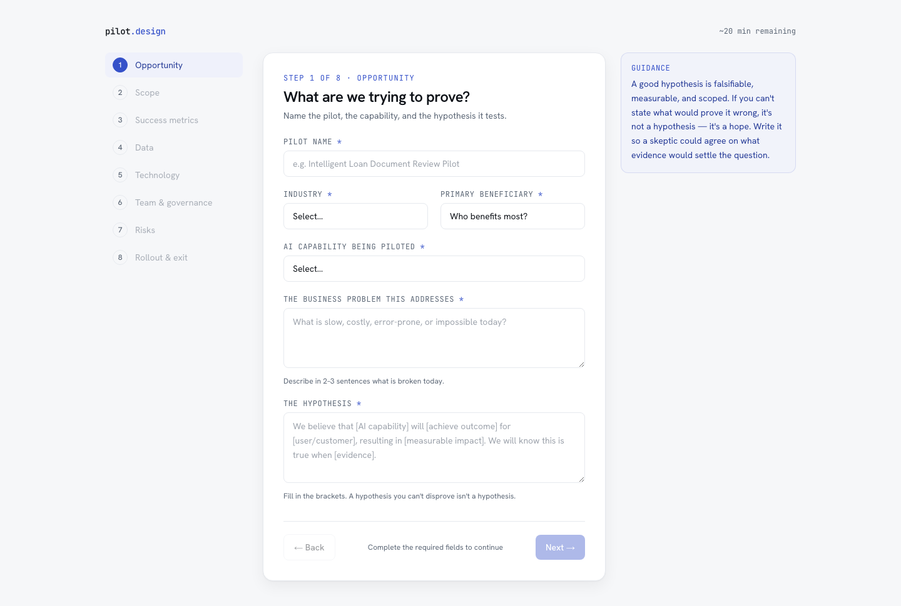

<div align="center">

# AI Pilot Design Wizard

**Design an AI pilot that survives the steering committee.**

Most AI pilots fail because they were never properly designed — no clear hypothesis,
no success metrics, no exit criteria. This eight-step wizard forces the discipline that
separates pilots that convert to production from the ones that die in committee, then
generates two board-ready documents with Claude.

</div>

<p align="center">
  
</p>

---

## What you get

Work through eight focused steps, then generate two documents in one streaming pass:

- **Pilot Brief** — a one-page, steering-committee-ready summary: hypothesis, scope, success
  criteria, key risks, investment, and a recommendation. Built to fit on a single printed page.
- **Pilot Playbook** — the full operational plan for the team: metrics tables, a RACI, a
  complete risk register, rollout and onboarding, governance, and exit criteria.

Both export to PDF or copy as text.

## The eight steps

| # | Step | What it captures |
|---|------|------------------|
| 1 | The opportunity | Pilot name and a *falsifiable* hypothesis |
| 2 | Scope & boundaries | A tight line around what you'll test |
| 3 | Success metrics | The bar for proceeding to production |
| 4 | Data requirements | Sources, readiness, and owners |
| 5 | Technology | The approach; minimizing the integration surface |
| 6 | Team & governance | Sponsor, lead, and deciders |
| 7 | Risks | A register with mitigations and early signals |
| 8 | Rollout & exit | The launch plan and the go/no-go decision |

<p align="center">
  
</p>

## Features

- **Validation that gates progress** — required fields block the Next button, so you can't
  generate a plan with holes in it.
- **Jump-back navigation** — the sidebar lets you return to any completed step; progress
  autosaves to `localStorage`, so a refresh never loses your work.
- **Smart starter risks** — Step 7 pre-populates suggested risks derived client-side from your
  industry and AI capability — no model call, instant.
- **Streaming generation** — both documents stream back in a single response and render live.
- **No database** — all state lives in React and `localStorage`. Nothing is stored on a server.

## Stack

- Next.js (App Router) + TypeScript
- Tailwind CSS
- Anthropic SDK (`@anthropic-ai/sdk`) with streaming
- `html2pdf.js` for PDF export
- Wizard state via `useReducer`, autosaved to `localStorage`

## Setup

```bash
npm install
cp .env.example .env.local   # then add your key
```

`.env.local`:

```
ANTHROPIC_API_KEY=your_key_here
```

Without a key the wizard UI still works — only document generation fails (the `/api/pilot`
route returns a 500 with a JSON error).

## Run

```bash
npm run dev      # dev server at http://localhost:3000
npm run build    # production build (also runs the full type-check + lint)
npm start        # serve the production build
npm run lint     # eslint (next/core-web-vitals)
```

There is no test runner; `npm run build` is the validation gate — it type-checks every file
and lints.

## Deploy on Vercel

This is a standard Next.js App Router app — Vercel auto-detects it. The only required config
is the API key, added as an environment variable (never commit it; `.env.local` is gitignored
and not deployed).

1. Import the repo at [vercel.com/new](https://vercel.com/new).
2. **Settings → Environment Variables**, add:
   - **Key:** `ANTHROPIC_API_KEY`
   - **Value:** your `sk-ant-...` key
   - **Environments:** Production, Preview, and Development
3. Deploy (or **redeploy** if you added the key after the first build — env vars only apply to
   builds created after they're set).

Or via the CLI:

```bash
vercel env add ANTHROPIC_API_KEY production   # paste the key; repeat for preview/development
vercel --prod
```

The key is read server-side in `app/api/pilot/route.ts` and never reaches the browser. Keep the
name exactly `ANTHROPIC_API_KEY`, and do **not** prefix it with `NEXT_PUBLIC_` (that would leak
it into the client bundle).

## How it works

1. Work through the 8 steps at `/wizard`. Required fields gate the Next button; the desktop
   sidebar lets you jump back to any completed step. Progress autosaves to `localStorage`.
2. Step 7 pre-populates starter risks derived client-side from your industry and AI capability
   (`data/wizard-steps.ts`) — no model call.
3. Click **Generate pilot documents** to go to `/results`, which POSTs the full wizard state to
   `/api/pilot`. The route streams both documents in one response, separated by a
   `<!-- DOCUMENT_BREAK -->` delimiter the results page splits on.
4. Switch between the **Pilot Brief** and **Pilot Playbook** tabs; export each as PDF or copy as
   text. **Edit inputs** returns to the wizard with everything preserved.

## Project layout

```
app/            landing, wizard, results pages + /api/pilot route
components/     WizardShell, step components, document renderers, export bar, UI primitives
data/           industries, step definitions/help text, starter-risk lookup, validation
lib/            types, wizard reducer + localStorage, prompt construction, PDF export
```

## Design

The visual system — typography, color, spacing, motion — is documented in
[`DESIGN.md`](DESIGN.md), the single source of truth. The look is an engineered instrument:
Hanken Grotesk + JetBrains Mono, cool neutrals, a single slate-cobalt accent, hairline
structure, no decoration.
